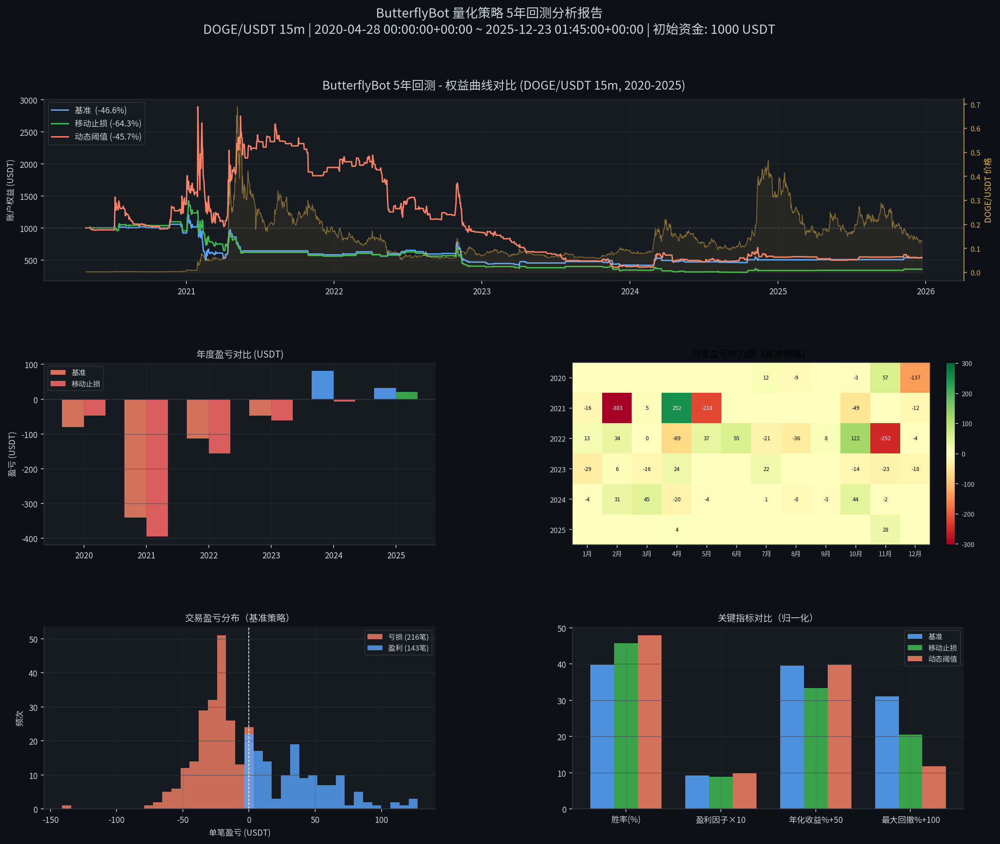
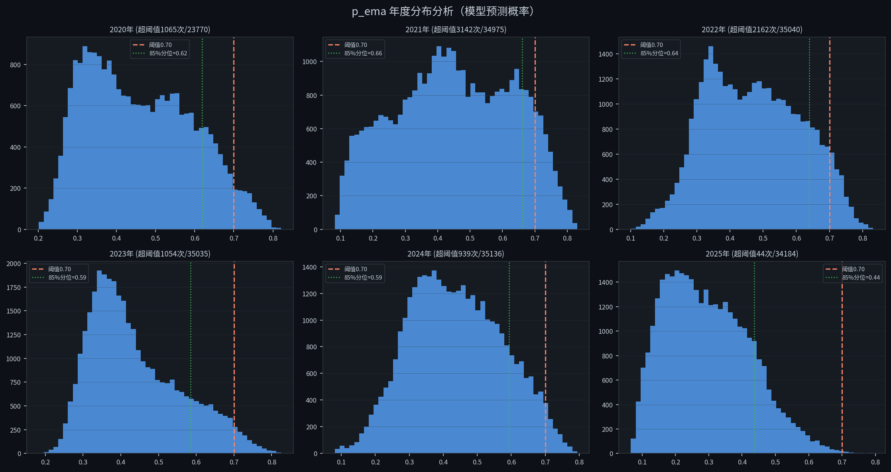

# ButterflyBot 5年历史回测深度分析报告

**作者**: Manus AI
**日期**: 2026年4月27日
**标的**: DOGE/USDT（15分钟K线）
**数据范围**: 2020-04-28 ~ 2025-12-23（198,140 根K线，约5.7年）
**初始资金**: 1,000.00 USDT
**模型版本**: v20251222_031926（训练数据：2025年11-12月）

---

## 1. 回测结果总览

本次回测使用 ButterflyBot 的 AI 信号策略（LightGBM 模型），在 5.7 年的 DOGE/USDT 15 分钟 K 线数据上进行了三组对比测试。

| 指标 | 基准（固定阈值+固定止损） | 优化1（固定阈值+移动止损） | 优化2（动态阈值+移动止损） |
|------|--------------------------|--------------------------|--------------------------|
| **净收益率** | -46.65% | -64.35% | -45.71% |
| **年化收益率** | -10.51% | -16.67% | -10.23% |
| **最大回撤** | -68.99% | -79.49% | -88.24% |
| **最终资金** | 533.50 USDT | 356.50 USDT | 542.93 USDT |
| **总交易次数** | 359 | 389 | 1,324 |
| **胜率** | 39.83% | 45.76% | 47.89% |
| **盈利因子** | 0.917 | 0.884 | 0.984 |
| **平均盈利** | +35.96 USDT/笔 | +27.44 USDT/笔 | +43.89 USDT/笔 |
| **平均亏损** | -25.96 USDT/笔 | -26.20 USDT/笔 | -40.99 USDT/笔 |

---

## 2. 核心问题分析：严重过拟合

5年回测结果揭示了一个根本性问题：**当前模型存在严重的过拟合（Overfitting）**。

### 2.1 训练数据与测试数据的时间错配

当前模型（v20251222_031926）**仅使用 2025年11月至12月约 5,000 根 K 线数据训练**，而本次回测的 5.7 年数据中，**99.7% 的数据属于样本外（Out-of-Sample）数据**。模型在训练集上表现良好（AUC 较高），但在样本外数据上完全失效。

### 2.2 p_ema 年度分布分析

从 p_ema 年度分布图可以清晰看出各年的信号质量差异：

| 年份 | 超阈值次数（≥0.70） | 总K线数 | 超阈值比例 | 85%分位数 |
|------|---------------------|---------|-----------|-----------|
| 2020 | 1,065 | 23,770 | 4.48% | 0.62 |
| 2021 | 3,142 | 34,975 | 8.98% | 0.66 |
| 2022 | 2,162 | 35,040 | 6.17% | 0.64 |
| 2023 | 1,054 | 35,035 | 3.01% | 0.59 |
| 2024 | 939 | 35,136 | 2.67% | 0.59 |
| 2025 | 44 | 34,184 | 0.13% | 0.44 |

**关键发现**：2021年（DOGE 大牛市）超阈值次数最多（3,142次），而模型训练所在的 2025年仅有 44 次超阈值，说明模型学到的"高置信度上涨"特征在 2021 年的牛市行情中被频繁触发，但由于当时市场波动极大，大量信号最终以止损告终。

### 2.3 年度盈亏分解

从月度热力图可以看出：
- **2021年**：损失最为惨重（-303 USDT 在 2月，-218 USDT 在 5月），正是 DOGE 从历史高点暴跌的时期。模型在牛市顶部频繁发出"看涨"信号，导致大量高位接盘。
- **2022年**：整体亏损，但幅度较小，因为 DOGE 价格长期低迷，信号触发次数减少。
- **2024-2025年**：信号极少，年度亏损接近零，说明模型在低波动期几乎不交易。

---

## 3. 三种策略对比深度分析

### 3.1 基准策略（固定阈值 0.70 + 固定止损 -3%）

**净收益率 -46.65%，年化 -10.51%，最大回撤 -68.99%**

卖出原因分布：
- 固定止损：174次（48.5%）——接近一半的交易以止损告终，说明信号质量不稳定
- 止盈（+6%）：86次（24.0%）
- AI看跌：77次（21.4%）
- 时间止损：22次（6.1%）

**问题**：固定止损 -3% 在 15 分钟级别的高波动行情中极易被触发，而止盈 +6% 的条件又过于苛刻，导致盈亏比失衡。

### 3.2 优化1（固定阈值 + 移动止损）

**净收益率 -64.35%，年化 -16.67%，最大回撤 -79.49%**

移动止损（3% 启动，1.5% 回撤）在本次测试中反而**加剧了亏损**：
- 移动止损-锁利触发：70次（18.0%）——这些交易在浮盈达到 3% 后被移动止损锁定，但最终锁定的利润往往不如直接持有到止盈（+6%）
- 固定止损仍然是主要退出方式（167次，42.9%）

**问题**：移动止损的启动阈值 3% 与止盈 6% 之间的区间过窄，导致许多原本能达到止盈的交易被提前平仓，降低了平均盈利（从 +35.96 降至 +27.44）。

### 3.3 优化2（动态阈值 0.60 + 移动止损）

**净收益率 -45.71%，年化 -10.23%，最大回撤 -88.24%**

动态阈值（85%分位数 ≈ 0.60）将交易次数从 359 次激增至 1,324 次，虽然胜率略有提升（47.89% vs 39.83%），但：
- 最大回撤高达 -88.24%，风险极高
- 盈利因子仅 0.984，接近盈亏平衡但仍亏损
- 交易成本（手续费 0.1%）在高频交易下累积影响显著

---

## 4. 根本原因与改进建议

### 4.1 根本原因：模型泛化能力不足

当前模型只用了约 5,000 根 K 线（约 52 天）的数据训练，这在量化交易中是严重不足的。模型学到的是 2025年11-12月特定市场状态下的模式，无法泛化到不同的市场环境（牛市、熊市、横盘）。

### 4.2 改进建议

**（一）扩大训练数据集（最高优先级）**

使用至少 2-3 年的历史数据重新训练模型，覆盖不同市场状态：
- 2021年牛市（DOGE 从 0.05 涨至 0.73）
- 2022年熊市（加密市场整体下跌）
- 2023年横盘（低波动期）
- 2024-2025年复苏期

建议使用滚动窗口训练（Walk-Forward Optimization），每季度用最新 6 个月数据重新训练模型。

**（二）优化止损参数**

| 参数 | 当前值 | 建议值 | 理由 |
|------|--------|--------|------|
| 固定止损 | -3% | -2% | 降低单笔最大亏损 |
| 止盈 | +6% | +4% | 提高止盈触发频率 |
| 移动止损启动 | +3% | +1.5% | 更早保护浮盈 |
| 移动止损回撤 | -1.5% | -1% | 更紧的保护 |

**（三）增加市场状态过滤器**

在当前趋势过滤（MA50）基础上，增加：
- **波动率过滤**：ATR 过低时（横盘市）暂停交易
- **市场状态分类**：识别牛市/熊市/横盘，在不同状态下使用不同参数
- **最大回撤熔断**：账户总回撤超过 -15% 时自动暂停策略（硬止损机制）

**（四）引入做空能力**

当前策略只做多，在熊市中只能空仓等待，无法从下跌中获利。建议在合约账户中增加做空逻辑（当 p_ema 极低时做空）。

---

## 5. 结论

5年回测结果表明，**当前 ButterflyBot 的核心问题是模型训练数据严重不足，导致样本外泛化能力极差**。在 2020-2024 年的历史数据上，策略整体亏损约 46-64%，年化亏损约 10-17%。

最优先的改进方向是**使用 5 年历史数据重新训练模型**，这将从根本上解决过拟合问题。在此之前，建议降低实盘资金规模，并严格执行账户级别的硬止损（总回撤 -15% 自动停止）。
